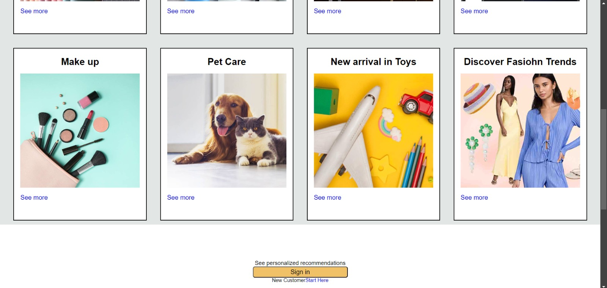

# Amazon UI Clone

This repository contains a clone of the Amazon user interface, implemented using HTML and CSS. This project replicates the look and feel of Amazon’s website to showcase front-end web development skills.

## Key Features

- **Responsive Layout:** The UI adapts to various screen sizes and devices for a seamless user experience.
- **Modern Design:** Includes navigation bars, product listings, search bars, and footer sections similar to Amazon’s homepage.
- **Styling and Layout:** Utilizes CSS techniques such as Flexbox and Grid for an organized and clean interface.
- **Static Content:** Mimics Amazon's homepage, product categories, and promotional banners.

## Screenshots

  
  

## How to View

To view the project locally:
 
**Clone the Repository:** 
 
**Open index.html**
 
**Clone Page loaded succesfully!** 
 
 
## Technologies Used
 
HTML: For the structure and markup of the webpage.
 
CSS: For styling and layout of the webpage.
 
Contributing
Contributions are welcome! If you have suggestions or improvements, please submit an issue or a pull request.
