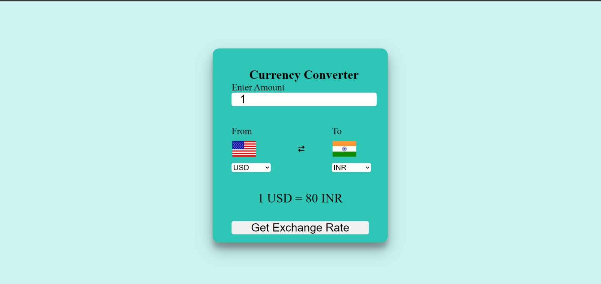
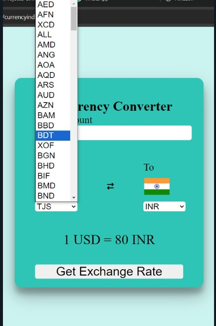

# Currency Converter
This project is a Currency Converter web application built using HTML, CSS, and JavaScript. The application fetches real-time exchange rates through an API and updates the displayed conversion accordingly. Additionally, the flags of the selected countries dynamically change based on the user's input.

## SccreenShots

  

  

## Features
Currency Conversion: Fetches the latest exchange rates using an API and displays the conversion instantly.
Dynamic Flag Display: Changes the flags corresponding to the selected currencies, enhancing the user experience.
Responsive Design: The application is designed to work seamlessly on various screen sizes.

## Technologies Used
HTML: Structuring the content of the web application.
 
CSS: Styling the user interface to provide a visually appealing design.
 
JavaScript: Implementing the logic for currency conversion and dynamically changing the flags.
 
API Integration: Used a currency exchange API to fetch real-time exchange rates.

# Getting Started
## Prerequisites
To run this project locally, you'll need:

A modern web browser (e.g., Chrome, Firefox, Edge).

## Installation
Clone the files located in the CurrencyConverter/codes directory.
Open the .html file in your preferred web browser to view the application.

## Usage
Enter Amount: Input the amount you wish to convert in the text box.
 
Select Currencies: Choose the currencies you want to convert from and to using the dropdown menus. The corresponding flags will update automatically.
 
Get Exchange Rate: Click the "Get Exchange Rate" button to fetch and display the conversion rate.

## API Integration
The application uses an external API to fetch the current exchange rates. Ensure you have a stable internet connection to access this feature.

## Contributions
Contributions are welcome! Please fork this repository and submit a pull request if you'd like to contribute to this project.

Acknowledgements
Thanks to the API provider for their free currency conversion service.
Special thanks to the web development community for their valuable resources and tutorials.
